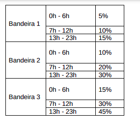
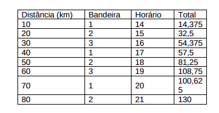

<h1>Carrara Drivers)</h1>

Agostinho é um taxista do Rio de Janeiro que deseja automatizar sua frota de táxis (Carrara
Drivers). Faça um programa em HTML/JS que:

<ul><li>a) Tenha um campo para nome do passageiro;</li>
<li>b) Tenha um campo para a distância (em km) do local atual para o destino do passageiro;</li>
<li>c) Tenha um campo - que só aceita número - que recebe a informação da bandeira da corrida (o
valor deve ser apenas 1, 2 ou 3); </li>
<li>c.1) Este campo só pode aceitar números e valores entre 1 e 3;</li>
<li>) Tenha um campo que recebe o horário da corrida (sistema de 24 horas e somente horas
inteiras);</li>
<li>d.1) Este campo só pode aceitar números e valores entre 0 e 23;</li>
<li>e) Ao clicar em "Calcular corrida", informe ao passageiro o valor final da corrida, com uma frase
assim:  
"Olá, NOME. Sua corrida, será na bandeira X, percorrerá Y km e o total da corrida será de Z"</li> 
<li>e.1) Siga a tabela abaixo para calcular o adicional por bandeira e horário:</li></ul> 
Obs: O valor nominal da corrida é de R$ 1,25 por km;
 
 

 

